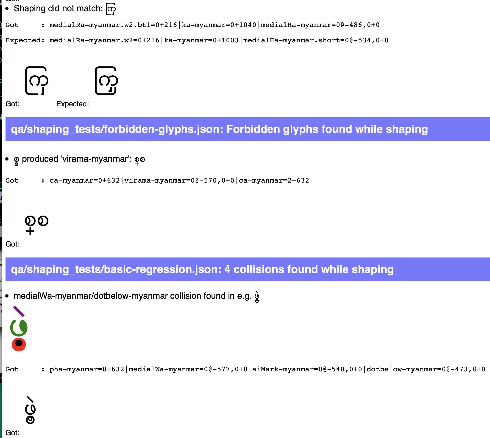

# Font engineering tools

This repository contains a number of smaller scripts and libraries that I find useful in my font engineering work and don't want to keep to myself.

## [`shape`](./shape)

This is a simple wrapper for `hb-shape` and `hb-view`, but I use it _all the
time_ - like, _hundreds_ of times a day. You will need to either be using
[iTerm2](https://www.iterm2.com/index.html) for your terminal and install the
[shell integration](https://www.iterm2.com/documentation-shell-integration.html)
tools so that it can display images inline, or [Kovid Goyal's TTY,
`kitty`](https://github.com/kovidgoyal/kitty). Once you've done that, use
`shape <fontfile> <text>` to display both the shaped glyph string and the
output image in your termal. You can also pass any command line arguments that
make sense to `hb-shape` or `hb-view`: `-V` to get a shaping trace,
`--features=...` and so on:


Top tip: if you're using `zsh` for your shell, add this to your `.zshrc` and you will be able to tab-complete font files:

    compdef '_files -g "*.?tf"' shape

## [`interrofont`](./interrofont)

General purpose tool for investigating OTF/TTF information from the command line. See http://www.corvelsoftware.co.uk/software/interrofont/ for usage.

## [`otfsurgeon`](./otfsurgeon)

General purpose tool for slicing and dicing OTF/TTF binary table data. Like
[`dumptable`](./dumptable) but more so:

```shell
otfsurgeon -i f.ttf dump --ttx name # Dumps name table as XML to stdout
otfsurgeon -i f.ttf dump name > name.bin # Dumps name table as binary to stdout

otfsurgeon -i f2.ttf add name < name.bin # Adds the name table from stdin

otfsurgeon -i f.ttf strip Debg DSIG # Removes the Debg and DSIG tables from the font

otfsurgeon -i f.ttf steal f2.ttf DSIG # Copies the DSIG table from f2.ttf
```

## [`fontshell`](./fontshell)

Sometimes you need to poke at a font in its fontTools representation. I got very tired of typing

```python-console
>>> from fontTools.ttLib import TTFont
>>> font = TTFont("whatever.otf")
```

_every single time_, so I wrote `fontshell`. Run `fontshell whatever.otf` and you are dropped into a Python REPL with the `font` variable set to a `fontTools.ttLib.ttFont.TTFont` object. Bonus: If you have IPython installed, you get tab completion of methods _and_ pretty colours too!

## [`dumptable`](./dumptable)

(Superceded by otfsurgeon)

This extracts a table from a sfnt file and outputs it as a raw binary string. I use this when debugging glyph naming issues and other times TTX gets too clever and doesn't tell me everything I need to know about a table. It's rare that you'll need it, but if you need it, you'll _really_ need it.

## [`glyphs2svg.py`](./glyphs2svg.py)

Converts a .glyphs file to a directory of .svg files.

## [`compare_shape.py`](./compare_shape.py)

I was converting a font from one format to another, and wanted to make sure that the layout rules were equivalent between the two. This script takes two fonts and a list of words, and checks that the shaping output from Harfbuzz is equal, outputting a report of passed and failed tests, as well as any shaping differences.

## [`shape-diff.py`](./shape-diff.py)

So, `compare_shape.py` told you that a test failed and there was a difference between the shaping outputs of two fonts, but it didn't tell you _why_ that happened. That's what `shape-diff.py` does. Give it two fonts and a text, and it'll report what went wrong:

```console
$ python3 shape-diff.py NNU.ttf NNU2.ttf 'نسس'
   font1⮯ ⮮font2
✔ GSUB( 5/20)  Noon=0|Seen=1|SeenFin=2
✔ GSUB( 4/19)  Noon=0|SeenMed=1|SeenFin=2
✔ GSUB( 3/15)  BehxIni=0|OneDotAboveNS=0|SeenMed=1|SeenFin=2
✔ GSUB(26/85)  BehxIni.outT2=0|OneDotAboveNS=0|SeenMed.inT2outT2=1|SeenFin=2
✔ GSUB(27/86)  BehxIni.outT2tall=0|OneDotAboveNS=0|SeenMed.inT2outT2=1|SeenFin=2
✔ GSUB(28/87)  BehxIni.outD1=0|OneDotAboveNS=0|SeenMed.SWinAoutT2=1|SeenFin=2

First difference appeared at GSUB lookup 158 (font1) / 37 (font2)
font1          BehxIni.outD1=0|sp0=0|sp0=0|OneDotAboveNS=0|SeenMed.SWinAoutT2=1|SeenFin=2
font2          BehxIni.outD1=0|OneDotAboveNS=0|SeenMed.SWinAoutT2=1|SeenFin=2
```

## vharfbuzz

vharfbuzz has graduated to [its own repository](https://github.com/simoncozens/vharfbuzz).

## [`stringbrewer`](./stringbrewer)

StringBrewer has graduated to [its own repository](https://github.com/simoncozens/stringbrewer).

## [`fontbakery-shaping.py`](./fontbakery-shaping.py)

This is a profile for [fontbakery](https://github.com/googlefonts/fontbakery) which adds regression testing for font shaping. It also produces pretty HTML reports:



To use it:

-   ensure that [`vharfbuzz.py`](#vharfbuzzpy) is in your Python path
-   place JSON files similar to [these](https://github.com/simoncozens/font-engineering/tree/master/qa/shaping_tests) in a directory called `qa/shaping_tests` (Yes, I'm sorry that's hard-coded).
-   run `fontbakery check-profile ./fontbakery-shaping.py <yourfont>`
-   read the report on the terminal, and also look in `qa/shaping_tests/report.html` for the HTML report.

## [`gnipahs.py`](./gnipahs.py)

_This is the *old* shaping regression tester. You should use `fontbakery-shaping.py` above instead._

`gnipahs` is a regression tester for font shaping. You pass it a font file
and a series of tests (some of which can be StringBrewer recipes) and it will
check your shaping. The default tests are for overlaps (using [collidoscope](https://github.com/simoncozens/collidoscope)) and shaping expectations. For example, here is a regression test file:

```
# This is a comment
#
# Literals (in quotes) by themselves just run the overlap test
"پپپ"
#
# You can also test that the shaping output is what you expect.
#
"سبے":BARI_YEf1=2+272|sdb.yb=1+0|BEm8=1+227@<0,275>|SINi9=0+450@<0,311>
"بممے":BARI_YEf1=3+272|MIMm6=2+104@<0,275>|MIMm4=1+203@<0,431>|sdb=0+0@<-34,230>|BEi7=0+412@<0,662>
#
# Lines without quotes are StringBrewer recipes
#
DotsBelow{0,3}
DotsBelow{0,3} TrickyEndCharacters

SomethingWithDotsBelow = ب,ی,پ
TrickyEndCharacters = ی,ے
```

This may output test results like so:

```
% python3 font.otf regression.txt
🗸  'پپپ' overlap test
🗴  'سبے' overlap test
🗴  'سبے' shaping text: expected BARI_YEf1=2+272|sdb.yb=1+0|BEm8=1+227@<0,275>|SINi9=0+450@<0,311> got BARI_YEf1=2+272|sdb=1+0@<-26,58>|BEm8=1+227@<0,275>|SINi9=0+450@<0,311>

...

🗴  'پپبے' overlap test
🗴  'پپیے' overlap test
🗴  'پپپے' overlap test

125 tests, 35 passed, 90 failing
```

Oh dear.

## [`glypholympics`](./glypholympics)

When composing test strings and writing OpenType rules, I often find myself wanting to know "What are the tallest glyphs in the font?" "What are the widest glyphs in the font?" And I haven't got time to open a font editor. I just want the answers.

```
$ ./glypholympics Hind-Regular.otf
Widest    :  dvK_S_P_LA(2082) dvmI.a31(2118) dvmI.a32(2169)
Narrowest :  NULL(0) CR(0) space(0)
                                                                [Horizontal ink]

Fattest   :  itfLogo(1648) dvL_K_YA(1670) dvK_S_P_LA(2038)
Thinnest  :  NULL(0) CR(0) dvmU(0)
                                                            [Horizontal advance]

Tallest   :  dvCandrabindu(1003) dvmEcandra_Anusvara(1003) dvmOcandra_Anusvara(1003)
Shortest  :  dvNukta(-75) dvVirama(-68) cedilla(-51)
                                                                          [yMax]

Highest   :  zerowidthnonjoiner(1041) zerowidthjoiner(1046) radical(1096)
Lowest    :  NULL(0) CR(0) space(0)
                                                                  [Vertical ink]

Deepest   :  dvmvRR(-440) dvmvLL(-437) dvNG_R(-373)
Shallowest:  dvCandrabindu(739) dvmEcandra_Anusvara(739) dvAnusvara.amI(834)
                                                                          [yMin]
```
